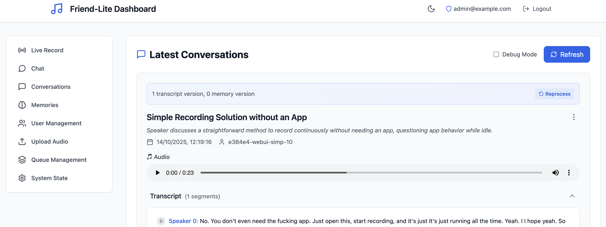

# Chronicle

Self-hostable AI system that captures audio/video data from OMI devices and other sources to generate memories, action items, and contextual insights about your conversations and daily interactions.

## Quick Start → [Get Started](quickstart.md)

Run setup wizard, start services, access at http://localhost:5173

## Screenshots

### WebUI Dashboard



### Memory Search


*[Mobile App - Screenshot coming soon]*


## What's Included

- **Mobile app** for OMI devices via Bluetooth
- **Backend services** (simple → advanced with full AI features)
- **Web dashboard** for conversation and memory management
- **Optional services**: Speaker recognition, offline ASR, distributed deployment

## Links

- **📚 [Setup Guide](quickstart.md)** - Start here
- **🔧 [Full Documentation](CLAUDE.md)** - Comprehensive reference
- **🏗️ [Project Overview](Docs/overview.md)** - Architecture and vision
- **🐳 [Docker/K8s](README-K8S.md)** - Container deployment

## Project Structure

```
chronicle/
├── app/                     # React Native mobile app
│   ├── app/                # App components and screens
│   └── plugins/            # Expo plugins
├── backends/
│   ├── advanced/           # Main AI backend (FastAPI)
│   │   ├── src/           # Backend source code
│   │   ├── init.py        # Interactive setup wizard
│   │   └── docker-compose.yml
│   ├── simple/            # Basic backend implementation
│   └── other-backends/    # Example implementations
├── extras/
│   ├── speaker-recognition/  # Voice identification service
│   ├── asr-services/        # Offline speech-to-text (Parakeet)
│   └── openmemory-mcp/      # External memory server
├── Docs/                   # Technical documentation
├── config/                 # Central configuration files
├── tests/                  # Integration & unit tests
├── wizard.py              # Root setup orchestrator
├── services.py            # Service lifecycle manager
└── *.sh                   # Convenience scripts (wrappers)
```

## Service Architecture

```
┌─────────────────────────────────────────────────────────┐
│                    Chronicle System                      │
├─────────────────────────────────────────────────────────┤
│                                                           │
│  ┌──────────────┐    ┌──────────────┐   ┌────────────┐ │
│  │ Mobile App   │◄──►│   Backend    │◄─►│  MongoDB   │ │
│  │ (React       │    │   (FastAPI)  │   │            │ │
│  │  Native)     │    │              │   └────────────┘ │
│  └──────────────┘    └──────────────┘                   │
│                            │                             │
│                            ▼                             │
│       ┌────────────────────┴────────────────┐          │
│       │                                     │          │
│  ┌────▼─────┐  ┌───────────┐  ┌──────────▼──┐        │
│  │ Deepgram │  │  OpenAI   │  │   Qdrant    │        │
│  │   STT    │  │   LLM     │  │  (Vector    │        │
│  │          │  │           │  │   Store)    │        │
│  └──────────┘  └───────────┘  └─────────────┘        │
│                                                         │
│  Optional Services:                                     │
│  ┌──────────────┐  ┌──────────────┐  ┌─────────────┐ │
│  │  Speaker     │  │  Parakeet    │  │  Ollama     │ │
│  │  Recognition │  │  (Local ASR) │  │  (Local     │ │
│  │              │  │              │  │   LLM)      │ │
│  └──────────────┘  └──────────────┘  └─────────────┘ │
└─────────────────────────────────────────────────────────┘
```

## Quick Command Reference

### Setup & Configuration
```bash
# Interactive setup wizard (recommended for first-time users)
./wizard.sh

# Full command (what the script wraps)
uv run --with-requirements setup-requirements.txt python wizard.py
```

**Note**: Convenience scripts (*.sh) are wrappers around `wizard.py` and `services.py` that simplify the longer `uv run` commands.

### Service Management
```bash
# Start all configured services
./start.sh

# Restart all services (preserves containers)
./restart.sh

# Check service status
./status.sh

# Stop all services
./stop.sh
```

<details>
<summary>Full commands (click to expand)</summary>

```bash
# What the convenience scripts wrap
uv run --with-requirements setup-requirements.txt python services.py start --all --build
uv run --with-requirements setup-requirements.txt python services.py restart --all
uv run --with-requirements setup-requirements.txt python services.py status
uv run --with-requirements setup-requirements.txt python services.py stop --all
```
</details>

### Development
```bash
# Backend development
cd backends/advanced
uv run python src/main.py

# Run tests
./run-test.sh

# Mobile app
cd app
npm start
```

### Health Checks
```bash
# Backend health
curl http://localhost:8000/health

# Web dashboard
open http://localhost:5173
```

## Vision

This fits as a small part of the larger idea of "Have various sensors feeding the state of YOUR world to computers/AI and get some use out of it"

Usecases are numerous - OMI Mentor is one of them. Friend/Omi/pendants are a small but important part of this, since they record personal spoken context the best. OMI-like devices with a camera can also capture visual context - or smart glasses - which also double as a display.

Regardless - this repo will try to do the minimal of this - multiple OMI-like audio devices feeding audio data - and from it:
- Memories
- Action items  
- Home automation

## Golden Goals (Not Yet Achieved)

- **Action items detection** (partial implementation)
- **Home automation integration** (planned)
- **Multi-device coordination** (planned)
- **Visual context capture** (smart glasses integration planned)

